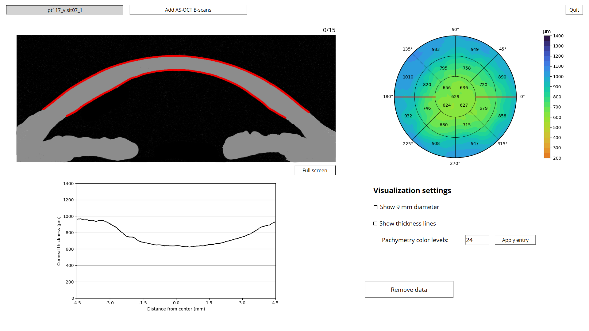
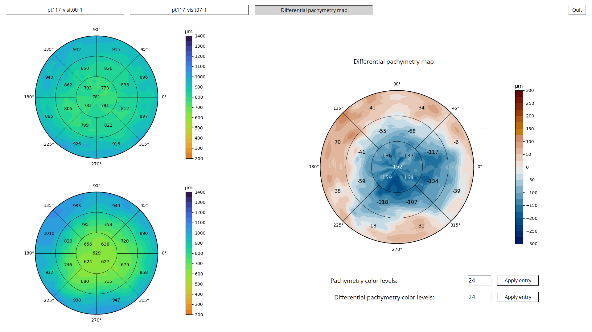

# Corneal thickness GUI
This repository contains the python code for a Tkinter GUI to analyze the thickness of the cornea from AS-OCT B-scans as part of my bachelor thesis. 
Before running the code, make sure that the libraries are installed using the `requirements.txt` file.
The workings of the GUI are explained below:

## Loading in the data
After starting starting the code, a full screen window is created with in the top left corner two buttons with 'Add AS-OCT scan' and one button in the top right corner to close the window.
A secondary window opens up when you click on one of the buttons to load in the data, for the user to select the files. Be aware that the program assumes that 16 B-scans are selected.
In case that less files are selected or the names were not according to the standard (e.g. pt001_visit07_1_im000), the program presents an error message and lets the user select the files again.
If a plausible selection is made, the B-scans are processed, delineations are predicted using the network, the predictions are processed, the thickness is measured and the pachymetry map is made.
This can take a couple of seconds. Unfortunately, the Tkinter window becomes unresponsive during this time, but this stops when the processing is finished. Loaded data can also be removed using the 'Remove data' button.

## Main screen
This screen is divided into 4 sections: The B-scan (top left), the pachymetry map (top right), the thickness profile plot (bottom left), visualization settings (bottom right). Two AS-OCT scans of 16 images can be loaded at the same time. Note that an artist impression of the B-scan was used for confidentiality reasons.

### B-scan
The B-scan is displayed together with the predicted delineation by the network in red. The user can use the scroll wheel of the mouse to scroll through the B-scans. 
Left clicking makes the delineation invisible, which allows for better comparison with the true corneal interface.

### Pachymetry map
The pachymatry map shows the thickness of the entire cornea from the B-scan measurements. The average thicknesses of the regions are displayed as numeric values as well. 
When the user scrolls through the B-scans, two opposite red lines start to rotate around the B-scan center, which indicates the B-scan that is currently displayed.

### Thickness profile plot
The thickness that is measured from the B-scan is also plotted in the thickness profile plot for more accurate interpretation. 
When the user scrolls through the B-scans, the thickness profile plot also changes to the corresponding B-scan

### visualisation options
The first settings that can be toggled on is 'Show 9mm diameter', which will plot two white vertical dashed lines to indicate the 9mm diameter region. This aligns with the thickness plot below.
The second option is 'Show thickness lines', which will show how the thickness is measured perpendicularly to the anterior interface for some of the measurement points.
The last settings lets the user select the number of color levels for pachymetry map by filling in a number between 1 and 200, followed by by pushing the apply entry button.

## Additional screens
Under the B-scan, a button is positioned that will show the B-scan in full screen mode. It is still possible to cycle through all the B-scans from the AS-OCT scan in full screen with the scroll wheel. 
The user can exit the full screen mode using a button under the B-scan. Furthermore, when two scans of the same patient are loaded in (determined from the filenames), another screen button at the top becomes visible which directs the user to the differential pachymetry map page.
At the top left and bottom left are the first and second pachymetry map displayed, respectively. At the right in the center, the differential pachymetry map is shown. Note that it is important to load in the data in the correct order (latest scan must be loaded in secondly).

